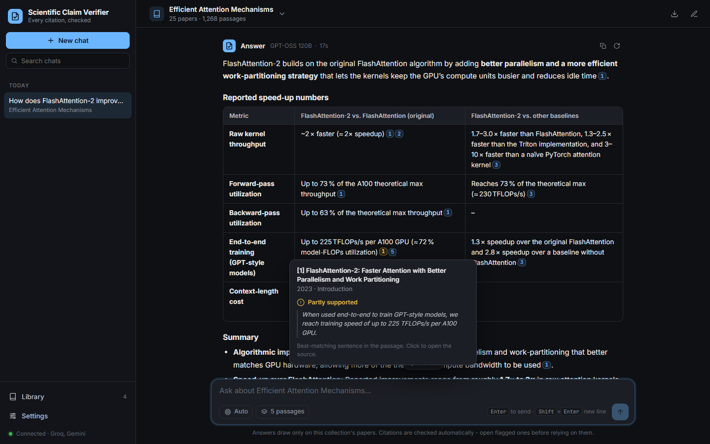
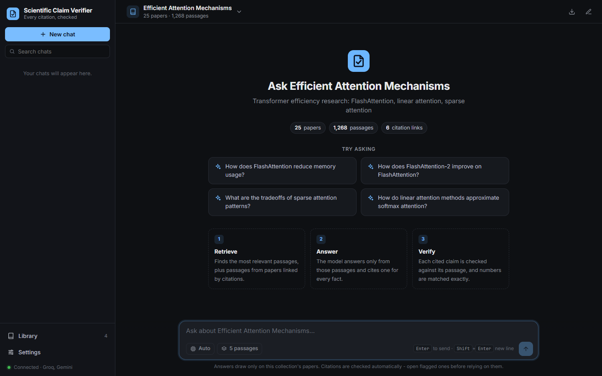
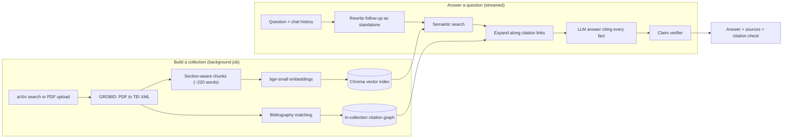

# Scientific Claim Verifier

**Ask questions about a collection of research papers and get answers where every cited claim is automatically checked against the passage it cites.**



LLM answers over papers look authoritative, but their citations are often decorative: the cited passage doesn't actually say what the sentence claims, or a number has drifted. This project treats verification as part of the answer rather than an afterthought. It retrieves passages from a curated set of papers (including papers linked by citations), has an LLM answer with a citation on every fact, then checks each cited claim against its passage — by meaning, by wording, and by matching every number exactly — and shows the result inline.

## Features

- **Verified answers** — every citation chip is coloured by whether its passage supports the claim; a claim-by-claim report shows the best-matching evidence sentence and flags figures that don't appear in the source.
- **Citation-graph retrieval** — besides semantic search, passages from papers that cite (or are cited by) the retrieved papers are pulled in, and the model is told to compare them and surface disagreements.
- **Build your own collections** — from an arXiv topic (an LLM suggests the searches; off-topic results are filtered by embedding similarity) or by uploading PDFs. PDFs are parsed with GROBID into section-aware passages.
- **Library** — inspect each collection's papers, spot off-topic ones by relevance score, remove them, rename, add PDFs, retry failed builds. Builds run in the background with live progress and survive server restarts.
- **Streaming chat** — pipeline progress (search → write → check), follow-up questions with conversation memory, math rendered with KaTeX, Markdown export, light/dark themes, mobile layout.
- **Provider fallback** — Groq (`gpt-oss-120b`) first, then Gemini, then `gpt-oss-20b`; or pick a model explicitly.

<table>
<tr>
<td width="50%"></td>
<td width="50%"></td>
</tr>
<tr>
<td align="center"><sub>Each collection opens with its own starter questions</sub></td>
<td align="center"><sub>The Library flags papers a broad search pulled in by mistake</sub></td>
</tr>
</table>

## How the verification works

1. **Extract claims.** Every sentence (or table row) carrying a citation becomes a claim. The parser understands `[Source 2]`, `[Sources 1, 3]`, `[Source 1; Source 4]`, ranges, parenthetical `(see Source 5)`, and gpt-oss's `【Source 4†L7-L12】` style — whose `†L7-L12` line markers are *not* source numbers.
2. **Score each (claim, cited passage) pair** with three signals:
   - *semantic* — cosine similarity (bge-small) between the claim and the passage's best-matching sentence or pair of adjacent sentences. That sentence is shown as the evidence.
   - *lexical* — the share of the claim's content words and numbers that appear in the passage (light stemming; the paper's title and year count, since the model saw them).
   - *numbers* — any figure in the claim (with a decimal, ≥ 10, or a unit like `3×` / `5%`) that never appears in the passage is flagged.
3. **Decide a status.** *Supported* needs strong overlap, or high semantic similarity **plus** some overlap — passages on the same topic routinely reach 0.80 cosine with claims they don't support, but share few words with them. A missing number caps a citation at *partly supported*. A citation to a source number that wasn't retrieved is *invalid*.
4. **Summarise.** Claims are rolled up into a verdict, and sentences with no citation at all are counted, since they can't be checked.

Thresholds were calibrated on real answers by comparing each claim against the passages it cited versus the retrieved passages it didn't. It is a fast, deterministic triage tool, not proof: it can miss subtle misreadings that keep the same words (see [Limitations](#limitations-and-roadmap)).

## Architecture



| Layer | Choice |
|---|---|
| API | FastAPI, server-sent events for streaming |
| UI | Vanilla ES modules (no build step), marked + DOMPurify + KaTeX vendored |
| Parsing | GROBID (Docker) → TEI XML → section classifier and sentence-aware chunker |
| Retrieval | `BAAI/bge-small-en-v1.5` embeddings in Chroma, citation-graph expansion |
| Generation | Groq `gpt-oss-120b` / `gpt-oss-20b`, Google Gemini |

## Quick start

You need an API key for [Groq](https://console.groq.com) and/or [Google Gemini](https://aistudio.google.com) (both have free tiers).

### With Docker (recommended)

```bash
cp .env.example .env          # add GROQ_API_KEY and/or GEMINI_API_KEY
docker compose up --build     # starts the app and GROBID
```

Open <http://localhost:8000>, then build a collection from **Library → New collection**, or from the command line:

```bash
docker compose exec app python build_collection.py efficient_attention
```

### Without Docker for the app

Requires Python 3.11+, plus Docker for GROBID only.

```bash
python -m venv venv
source venv/bin/activate            # Windows: venv\Scripts\activate
pip install -r requirements.txt
cp .env.example .env                # add your API key(s)

docker run -d -p 8070:8070 grobid/grobid:0.8.2-crf

cd src
python build_collection.py efficient_attention   # downloads ~25 papers; takes 10-15 min
uvicorn api:app --reload
```

Open <http://localhost:8000>. API docs are at <http://localhost:8000/docs>.

`config/domains/` holds the recipes for four example collections (`efficient_attention`, `arc_agi`, `graph_neural_networks`, and an upload-based one); `python build_collection.py --list` shows which are built.

## Evaluation

`src/eval_harness.py` answers a fixed set of 20 questions about the *Efficient Attention* collection — 8 single-paper factual lookups, 6 cross-paper comparisons, 4 agreement/contradiction checks between citation-linked papers, and 2 out-of-scope questions that should be refused — and scores retrieval and citation faithfulness. It is resumable, so free-tier rate limits never cost completed work.

Latest run (October 2026, `gpt-oss-120b` via Groq, 5 passages per question plus citation-linked ones):

| Metric | Result |
|---|---|
| Expected paper retrieved (questions that have one) | **9 / 9** |
| Cited claims checked | 64 |
| Supported · partly supported · not supported | **75%** · 17% · 8% |
| Mean support score, in-scope answers ¹ | 0.84 |
| Out-of-scope questions correctly declined | **2 / 2** |
| In-scope questions declined | 1 / 18 ² |
| Sentences without a citation, per answer | 2.8 on average |
| Median end-to-end latency | 3.6 s |

| Category | Questions | Claims | Supported | Partly | Not supported |
|---|---:|---:|---:|---:|---:|
| Single-paper factual lookup | 8 | 21 | 16 | 4 | 1 |
| Cross-paper comparison | 6 | 24 | 18 | 5 | 1 |
| Agreement / contradiction between linked papers | 4 | 16 | 12 | 2 | 2 |
| Out of scope (should decline) | 2 | 3 | 2 | 0 | 1 |

¹ (supported + ½ partly) / claims. ² An agreement question whose retrieved passages contain no directly comparable figures — declining there is defensible.

These figures are what the automatic verifier measures (citation faithfulness), not human-judged correctness, and its thresholds were calibrated on an earlier batch of answers, not on this one. `python eval_harness.py --rescore` re-verifies the saved answers in `eval/raw_answers/` without calling the LLM, which makes it cheap to iterate on the verifier.

```bash
cd src
python eval_harness.py                 # writes eval/results.csv and eval/results_summary.json
```

Building the verifier surfaced a real measurement bug in the first version of this harness: it read gpt-oss's `【Source 4†L7-L12】` line markers as citations of sources 7 and 12 and counted them as invalid. One answer's 11 citations were counted as 32, and it scored 0.31; re-checked with the fixed parser, 7 of its 11 claims are supported, 3 partly and 1 not. Those earlier results are kept in `eval/results_v1_keyword_only.csv`.

## API

| Method | Path | Purpose |
|---|---|---|
| `POST` | `/query/stream` | Ask a question; server-sent events: `status`, `sources`, `token`, `done`, `error` |
| `POST` | `/query` | Same, as one JSON response |
| `GET` | `/domains`, `/domains/{id}` | Ready collections with stats; one collection with its papers |
| `GET` | `/jobs`, `/domains/{id}/status` | Builds in progress or failed |
| `POST` | `/domains/request` · `/domains/upload` | Build from arXiv queries · from uploaded PDFs (or add PDFs) |
| `POST` | `/domains/suggest-queries` | Turn a topic into arXiv searches |
| `PATCH` · `DELETE` | `/domains/{id}` | Rename/describe · delete a collection |
| `POST` | `/domains/{id}/retry` | Resume a failed build |
| `DELETE` | `/domains/{id}/papers/{paper_id}` | Remove one paper |
| `GET` | `/health`, `/models` | Provider/GROBID status; selectable models |

```bash
curl -s localhost:8000/query -H 'Content-Type: application/json' \
  -d '{"domain": "efficient_attention", "question": "How does FlashAttention reduce memory usage?"}' \
  | jq '.verification.summary'
```

Endpoints that create, change or delete collections require an `X-API-Key` header when `API_KEY` is set.

## Configuration

All settings are environment variables (see `.env.example`).

| Variable | Default | Purpose |
|---|---|---|
| `GROQ_API_KEY`, `GEMINI_API_KEY` | — | LLM providers; set at least one |
| `GEMINI_MODEL` | `gemini-3.8-flash` | Gemini model id |
| `API_KEY` | — | Admin key for collection management; unset disables auth (local use) |
| `GROBID_URL` | `http://localhost:8070` | PDF parser |
| `RATE_LIMIT_PER_MINUTE` | `20` | Questions per minute per client IP (`0` disables) |
| `ADMIN_RATE_LIMIT_PER_MINUTE` | `30` | Same, for query suggestions |
| `LLM_TIMEOUT_SECONDS` | `90` | Per-request LLM timeout |
| `CORS_ORIGINS` | — | Comma-separated origins allowed to call the API cross-site |

## Project layout

```
src/
  api.py                 FastAPI app: query, streaming, collection management, static UI
  generate_answer.py     retrieve -> prompt -> generate -> verify pipeline
  verify_citations.py    claim extraction and citation verification
  search_with_graph.py   semantic search + citation-graph expansion
  generation.py          Groq/Gemini clients, streaming, fallback
  ingestion.py           background builds, job state, collection management
  fetch_papers.py        arXiv search with relevance filtering
  parse_papers.py        GROBID parsing; metadata backfill for uploads
  extract_sections.py    TEI -> section-aware chunks and references
  build_index.py         embeddings -> Chroma
  build_citation_graph.py  bibliography -> in-collection citation edges
  build_collection.py    CLI for the whole build pipeline
  eval_harness.py        evaluation
  static/                web UI (index.html, css/, js/, vendored libraries)
config/domains/          one YAML recipe per collection
tests/                   pytest suite (no network or models needed)
scripts/                 one-off debugging and analysis helpers
eval/                    evaluation results and raw answers
```

## Development

```bash
pip install -r requirements-dev.txt
pytest -q
```

The tests stub out retrieval and the LLM, so they run in a few seconds without API keys or downloaded models. CI runs them on every push.

## Security notes

- Collection ids and paper ids are validated before they reach the filesystem — an unvalidated `DELETE /domains/..` would otherwise resolve to the whole `data/` directory.
- Uploads are checked for the PDF signature and size before anything is written, and oversized requests are rejected from the `Content-Length` header before the body is read.
- Model output is sanitised with DOMPurify, and images are stripped: retrieved PDF text can steer the model (prompt injection), and a Markdown image is a classic way to exfiltrate data to a third-party URL.
- Per-IP rate limiting on the endpoints that spend LLM quota; set `API_KEY` before exposing an instance to others.
- Chats are stored only in the user's browser.

## Limitations and roadmap

- **Verification is heuristic.** Embedding similarity plus lexical overlap catches unsupported and mis-cited claims and wrong numbers, but not a claim that reuses the passage's words while reversing its meaning. Next step: an NLI cross-encoder or an LLM-as-judge pass on the claims it marks as partly supported.
- **Single-instance design.** Build jobs run in-process (one at a time), and rate limits live in memory. Horizontal scaling would need a job queue (e.g. Redis + RQ) and shared state.
- **No accounts.** Chats live in browser storage; a shared deployment needs user auth and server-side history.
- **Discovery is arXiv-only**, and the citation graph only links papers inside the same collection. Semantic Scholar or OpenAlex would add journals and external citation context.
- **Free-tier quotas.** Groq's free tier allows roughly two questions a minute on the 120B model; the fallback chain keeps answering, with a different model, when it's exhausted.
